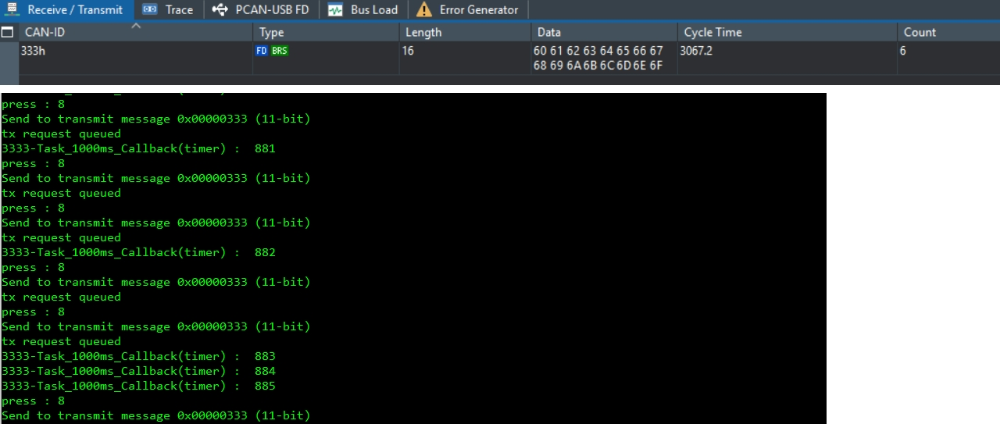
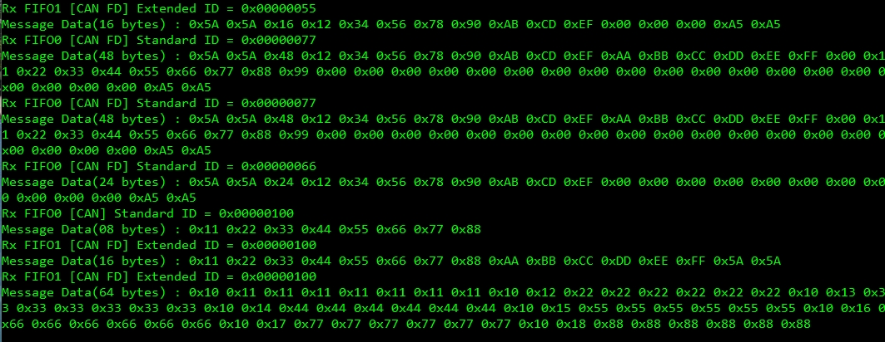

# M2A23BSP_CANFD_TX_RX

M2A23 BSP example for:

- Application code in `APROM`
- Application checksum generated by `SRecord`

Update: `2026/05/15`

## Overview

- `AP`
  Application code in `APROM 64KB`

Current flash map:

| Region | Address | Size | Note |
| --- | --- | --- | --- |
| AP code | `0x00000000 ~ 0x0000FFFF` | `64KB` | SRecord fills binary to full app size |
| APP checksum | `0x0000FFFC` | `4 bytes` | Last 4 bytes of AP image |

Related settings:

- Flash layout runtime constants:
  [memory_map.h](SampleCode/Template/memory_map.h)
- AP checksum / output size:
  [checksum_config.cmd](SampleCode/Template/AP/Keil/checksum_config.cmd)

## App Code

Application project: `SampleCode/Template/AP`

### Hardware Pins

Application uses these pins:

- `UART0`
  `PB12=RXD0`, `PB13=TXD0`
- `CANFD0`
  `PC4=CANFD0_RXD`, `PC5=CANFD0_TXD`
- `CAN mode select`
  `PC3` output low
- `LED`
  `PF14`

### Checksum by SRecord

AP image checksum is generated by `SRecord`.

Flow:

- Keil builds `APROM_application.axf`
- Post-build creates `APROM_application.bin`
- `generateChecksum.bat` calculates CRC32
- CRC32 is written to the last 4 bytes of the APP image
- Script also generates:
  `APROM_application_crc.hex`

Current checksum settings:

- APP start:
  `0x00000000`
- APP size:
  `0x00010000`
- CRC store address:
  `0x0000FFFC`

Files:

- [generateChecksum.bat](SampleCode/Template/AP/Keil/generateChecksum.bat)
- [checksum_config.cmd](SampleCode/Template/AP/Keil/checksum_config.cmd)

### Normal App Power-on

Typical APP startup log includes:

- `Reset Source <...>`
- `power on from ...`
- CAN mode / bitrate information
- UART key map

## App Functions

### CAN TX

UART control:

- `8`
  send CAN FD SID `0x333`, `16 bytes`
- `9`
  send CAN FD XID `0x4444`, `32 bytes`

Result output:

- UART log prints TX request information
- CAN analyzer / PCAN should be used to confirm bus traffic

Images:

### CAN RX

Behavior:

- APP receives CAN / CAN FD message
- `CAN_Rx_process()` prints received ID, frame type and payload

Result output:

- UART log

Image:

### Wake-up by CAN

UART control:

- `7`
  enter standby and wait for CAN wake-up

Behavior:

- APP enters standby
- CAN RX IRQ wakes MCU
- Wake-up result is printed on UART

Image:

## If App Size Changes

If APP size or checksum location must be changed later, update these places together:

1. [memory_map.h](SampleCode/Template/memory_map.h)
   update `APROM_SIZE_BYTES`, `APP_END_ADDR`, `APP_CHECKSUM_ADDR`
2. [checksum_config.cmd](SampleCode/Template/AP/Keil/checksum_config.cmd)
   update `APROM_SIZE`, `APP_SIZE`, `CRC_ADDR`

